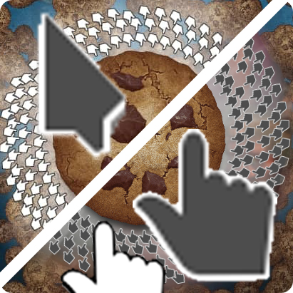

# Breeze cursor mod for Cookie Clicker  
Use KDE's Breeze dark and light cursors on Cookie Clicker!  

### Installation
### Steam Workshop:
Just subscribe to https://steamcommunity.com/sharedfiles/filedetails/?id=2700647149
    
### <a href="https://github.com/klattmose/CookieClickerModManager">Cookie Clicker Mod Manager</a>:  
Just add the following code to the extension:  
`````https://raw.githubusercontent.com/agostaxyz/cookie-clicker-breeze-cursor/main/ccmm.js`````

### JavaScript Bookmark:  
It's browser specific so no tutorial, but this is the code you need:    
`````Game.Loader.Replace('cursor.png',src="https://raw.githubusercontent.com/agostaxyz/cookie-clicker-breeze-cursor/main/breeze-cursorMod/cursor.png");`````
